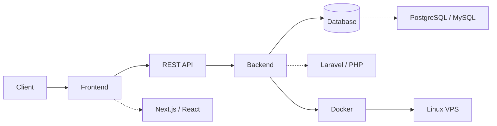

<div align="center">

# CHANDRA ADITIYA PUTRA

### Full-Stack Developer


<br>

`BUILD` · `SOLVE` · `SHIP` · `IMPROVE`

</div>

---

## `> system_profile`

```yaml
name: Chandra Aditiya Putra
role: Full-Stack Developer
location: Karawang, West Java, Indonesia

status:
  backend: ACTIVE
  frontend: ACTIVE
  database: ACTIVE
  deployment: ACTIVE
  coffee: ALWAYS_ON

current_focus:
  - Full-Stack Development
  - Backend Systems
  - REST API
  - Database Design
  - Docker & Linux
  - Application Deployment
```

---

## `> about_me`

I'm an **Informatics Engineering student** focused on full-stack development and building practical applications from end to end.

I enjoy working beyond the interface — designing databases, building APIs, implementing business logic, integrating frontend applications, and deploying systems into production.

```text
Problem
   ↓
Analyze
   ↓
Design
   ↓
Build
   ↓
Test
   ↓
Deploy
   ↓
Improve
```

---

## `> system_architecture`



> I like understanding how every layer connects — from the user interface to the database and production environment.

---

## `> tech_stack`

### Backend

<p>
  
</p>

`PHP` · `Laravel` · `Node.js` · `REST API` · `JWT`

### Frontend

<p>
  
</p>

`Next.js` · `React` · `TypeScript` · `JavaScript` · `Tailwind CSS` · `Angular`

### Database & Data

<p>
  
</p>

`PostgreSQL` · `MySQL` · `Supabase` · `Prisma ORM`

### Infrastructure & Tools

<p>
  
</p>

`Docker` · `Linux` · `Nginx` · `VPS` · `Git` · `GitHub`

---

# `> systems_i_have_built`

### ☕ Coffee Karawang

**Full-Stack Cafe Discovery Platform**

A production web application for discovering and exploring coffee shops in Karawang.

```text
Next.js
   ↓
API
   ↓
PostgreSQL
   ↓
Prisma
   ↓
Docker
   ↓
Linux VPS
```

**Stack**

`Next.js` `TypeScript` `PostgreSQL` `Prisma` `Supabase` `Docker`

**Status:** 🟢 `LIVE / PRODUCTION`

🌐 [Live Application](https://kopikarawang.my.id)  
💻 [Source Code](https://github.com/chandra7251/coffe_karawang)

---

### 📑 ZETA E-Procurement

**Procurement Management System**

Full-stack procurement system designed to digitalize procurement workflows including vendor management, tenders, bidding, and digital contracts.

```text
Ionic Client
     ↓
REST API
     ↓
Laravel
     ↓
MySQL
```

**Stack**

`Laravel` `PHP` `MySQL` `REST API` `JWT` `Ionic`

**Status:** 🔵 `RELEASED`

💻 [Source Code](https://github.com/chandra7251/e-tender)

---

### 🏋️ Hunter Log

**Android Gym Workout Tracker**

Offline-first Android application for recording workouts, monitoring progress, tracking personal records, workout history, and training statistics.

```text
Ionic + Angular
       ↓
   Capacitor
       ↓
    Android
       ↓
  Google Play
```

**Stack**

`Ionic` `Angular` `TypeScript` `Capacitor`

**Status:** 🟢 `PUBLISHED ON GOOGLE PLAY`

📱 [Google Play](https://play.google.com/store/apps/details?id=com.chandra.hunterlog)  
💻 [Source Code](https://github.com/chandra7251/Hunter-Log)

---

### 🧾 Cafe POS

**Cashier & Owner Management System**

Full-stack Point of Sale system designed around cashier operations and business owner workflows.

```text
React
  ↓
Inertia.js
  ↓
Laravel
  ↓
Database
```

**Stack**

`Laravel` `React` `Inertia.js` `PHP`

**Testing:** `Playwright E2E`

**Status:** ⚪ `SOURCE AVAILABLE`

💻 [Source Code](https://github.com/chandra7251/casher_and_owner)

---

### 💰 KeuanganKu

**Student Financial Management & Parent Monitoring System**

Financial management platform with transaction tracking, financial analytics, reporting, parent-student account pairing, balance transfers, and administrative monitoring.

```text
Web Client
    ↓
PHP Application
    ↓
MySQL
    ↓
Analytics & Reports
```

**Stack**

`PHP` `MySQL` `Tailwind CSS` `Chart.js`

**Status:** ⚪ `SOURCE AVAILABLE`

💻 [Source Code](https://github.com/chandra7251/KeuanganKu)

---
## `> github_activity`

<div align="center">

<picture>
  <source
    media="(prefers-color-scheme: dark)"
    srcset="https://raw.githubusercontent.com/chandra7251/chandra7251/output/github-contribution-grid-snake-dark.svg"
  />
  <source
    media="(prefers-color-scheme: light)"
    srcset="https://raw.githubusercontent.com/chandra7251/chandra7251/output/github-contribution-grid-snake.svg"
  />
  
</picture>

</div>

---

## `> current_focus`

```bash
chandra@dev:~$ cat current-focus.txt

[+] Improving backend architecture
[+] Building maintainable REST APIs
[+] Database design & optimization
[+] Dockerizing applications
[+] Linux & VPS deployment
[+] Shipping applications to production

chandra@dev:~$ █
```

---

## `> connect`

<div align="center">

<a href="https://www.linkedin.com/in/chandra-aditiya-putra-189249385/">
  
</a>

<a href="https://github.com/chandra7251">
  
</a>

</div>

<br>

<div align="center">

```text
BUILD → SOLVE → SHIP → IMPROVE
                     ↳ powered by coffee ☕
```

</div>
